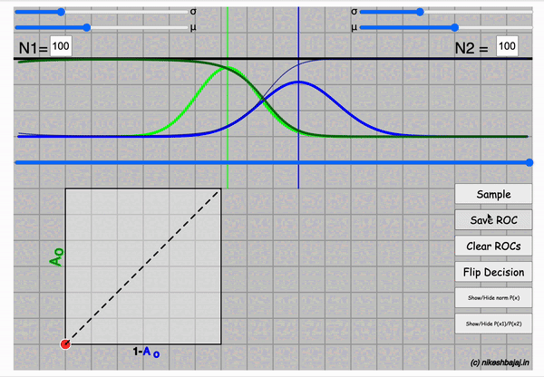
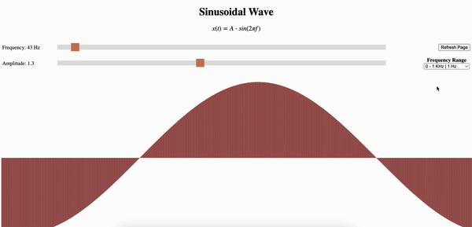

 
 
 

# Web-based interactive demos

For tutorials and explanation

 
 

  

    

    
<b>Sampling/Hypothesis testing</b>

    

        

          
<strong>Statistics:</strong> <a class="reference external" href="./Stats/sampling">For Hypothesis Testing and T-test</a>

          
      

    

  

  

    

    
<b>ROC: Receiver Operating Characteristics</b>

    

      

      
<strong>Machine Learning:</strong> <a class="reference external" href="./ML/roc_v3.html">For Understanding ROC</a>

      
      

    

  

  

    

    
<b>Sinusoidal Player</b>

    

      

      
<strong>Singal Processing:</strong> <a class="reference external" href="./SP/sinusoidal_player.html">Sinusoidal Player</a>

      
      Sinusoidal wave with sounds
      

    

  

 
 
 

  <h2>List of demos</h2>
  

  <h3 id="about"><a href='./Stats/sampling' target="_blank">1. Statistics - Sampling and Hypothesis Testing.</a></h3>
  <h3 id="about"><a href='./ML/roc_v1.html' target="_blank">2. ROC for PML Course (V1).</a></h3>
  <h3 id="about"><a href='./ML/roc_v2.html' target="_blank">3. ROC for PML Course (V2).</a></h3>
  <h3 id="about"><a href='./ML/roc_v3.html' target="_blank">4. ROC for PML Course (V3).</a></h3>
 V3 includes more details and explanation of the widget

  <h3 id="about"><a href='./SP/sinusoidal_player.html' target="_blank">5. Sinusoidal Player.</a></h3>
  

