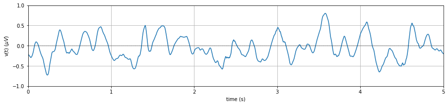

<!-- -->

The objective of this section is to make signal processing more intutive for non-engineers, such as clinicians, chemists, statisticians, psychologist etc, who have to deal with different kind of signals and processing. In this tutorial, we will try to avoid math as much as possible and solely focus on characterstics of signal and processing methods such filtering as a box.

# Table of Contents (in progress...)
* [Chapter 1: Signal](#chapter-1)
* [Chapter 2: Filtering](#chapter-2)

# Chapter 1: Signal

## 1.1 What is Signal?
**Loosely speaking:** I used to explain 'signal' to undergraduate students, as anything that convay information is a signal . Information can be useful (i.e. message) or not (noise), varyies over time (voltage) or space (image). This makes everything around you as signal. You see (image) or hear (audio) anything or focus/record any one aspect (voltage, hand movement, monthly pockate money, your grades over the years), ***almost*** everything can be seen as signal. However word almost was a trick there.

**Strictly speaking:** Any phenomenon; physical, electrical, biological, chemical, (even any hypothetical), that varies over time, space, or in any abstract dimension can be seen as a signal. These phenomenon are not mutually exclusive, biological systems have physiocal, electrical and chemical processes, electrical systems are physical systems too. The importance here is **the variation**. The variation of any phenomenon over any one or more dimensions can be a signal. A classical example of a signal (us are noually in text books) is a speech signal, x(t), where an aucostic pressure (recorded as voltage), varies over time. An image I(x,y), an intensity of light recorded, that varies over 2D space (in x and y cordinate systems). A video or moviev, I(x,y,t) is a recording of light intensity varying over space (x,y) and time (t).

Some more examples are here: Stocks price of a company changing over the time, your daily expendature, electricity consuption of your house.
* **Physical:** Air pressure recorded over time on a single point a(t), vibrations of machine or a system v(t), motion of an object in 3-dimensional world over a time, p(x,y,z,t).
* **Electrical:** Voltage v(t)/current I(t) variation in a circuit.
* **Biological:** Human body also exhibit eletrical properties: At cellular level - membrane potentials (voltage difference between in and out of a cell), firing rate of nueros in the brain. Blood sugar over a time.
* **Chemical:** Release/absorbtion of an energy, reaction time, strength of a bond, they all can vary over time.

Above all examples and phenomenon are measured and/or recorded in one way or another. The measurement/recording of these quantities should be continuation in any one (at least) dimention (time, space, or any one). Notice the word - ***Variation*** in the quantity, that could be capture only if measurement is done more than once and continuation over at least one dimention. Measurement, voltage for example, at a signal point in time does not qualify it to be a sigal. Continuation over a dimention, does not define frequency of recording, such as 1 recording per second, per micro second, per month, or per year. There is a funny line I used to say "Computer science people call it data, and Electrical Engineers call it signal". However there is a catch, not all data are signal. For example, a table of data, where values are not varying over any dimension of single phenomenon is not a signal. They are again a single measurements of respective quantities.

## 1.2 Variation: Frequency representation
As highlighted, the variation of a phenomenon in a dimension can be seen as a signal, and variation in a signal is the most important characterstics that we care about. If a signal is constant over a time, for example a voltage supply of 220 KVolt, that inform you no variation thus, a single point measurement is enough to describe it, and no need of measring a continues values.
On the other hand, variation tells a lot about the phenomenon, so we analysis vaeiations of the signal.

     
## 1.3 Anolog to Digital (sampling)

     

# Chapter 2: Filtering

     
           
                      

.
.

