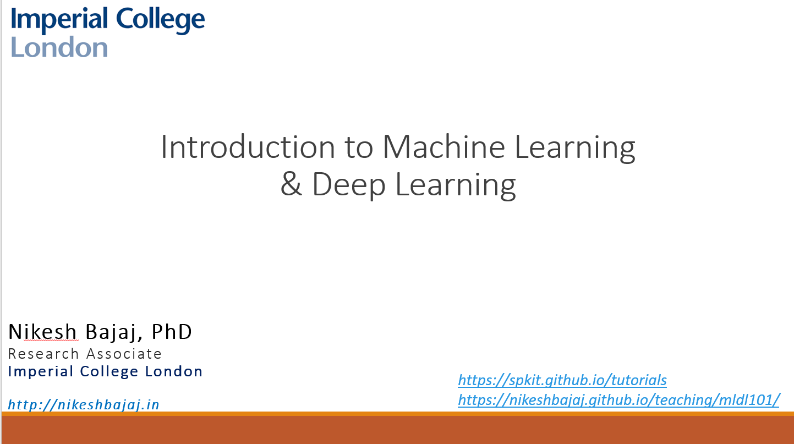

 

<h3 style="font-weight:600; font-family: sans-serif;"> Hands on practice on Machine Learning & Deeplearning 

</h3>   ...
  

 

<ul class="simple" style="line-height:1.4;">
  <li><h4>Slides (dated: 30/07/2021 - CU_FDP)<a href="https://github.com/Nikeshbajaj/Notebooks/blob/master/Tutorials_ML_DL/Intorduction_to_ML_&_DL_30_07_21.pptx?raw=true" target="_blank"> PPT</a> | <a href="https://github.com/Nikeshbajaj/Notebooks/blob/master/Tutorials_ML_DL/Intorduction_to_ML_%26_DL_30_07_21.pdf" target="_blank">PDF</a></h4></li>
</ul>

<ul class="simple" style="line-height:1.4;">
  <li><h4>Jupyter-notebooks</h4>
    <ul class="simple">
    <li><a href="https://nbviewer.jupyter.org/github/Nikeshbajaj/Notebooks/blob/master/Tutorials_ML_DL/1_Regression_Boston_price.ipynb" target="_blank">1. Regression (Boston House Price)</a></li>
    <li><a href="https://nbviewer.jupyter.org/github/Nikeshbajaj/Notebooks/blob/master/Tutorials_ML_DL/2_Classification.ipynb" target="_blank">2. Classification (Breast Cancer, Iris, MNIST)</a></li>
    <li><a href="https://nbviewer.jupyter.org/github/Nikeshbajaj/Notebooks/blob/master/Tutorials_ML_DL/3_Deeplearning_CNN.ipynb" target="_blank">3. Deeplearning (MNIST)</a></li>
    <li><a href="https://nbviewer.jupyter.org/github/Nikeshbajaj/Notebooks/tree/master/Tutorials_ML_DL/" target="_blank">All notebooks</a></li>
    </ul></li>
  <li><h4>Google Colab</h4>
    <ul class="simple">
    <li></li>
    <li></li>
    <li></li>
    </ul></li>
  <li><h4>Binder</h4>
    <ul class="simple">
    <li><a href="https://mybinder.org/v2/gh/Nikeshbajaj/Notebooks/HEAD" target="_blank">All notebooks</a></li>
    <li><a href="https://tinyurl.com/MLTutorial" target="_blank">https://tinyurl.com/MLTutorial</a></li>
    </ul></li>
</ul>

 

