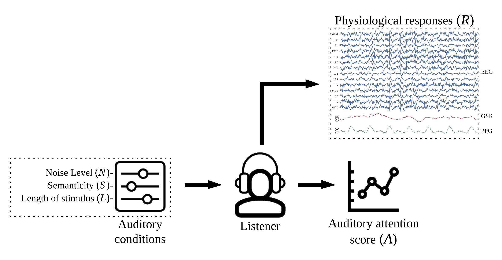

 

<h3 style="font-weight:600; font-family: sans-serif;"> PhyAAt - Physiology of Auditory Attention 

</h3>   ...
  

 

<h3> . </h3>

<h3> Resources </h3>
<h4>Slides - <a href="./PhDwork_Seminar_AtImperial.pdf" target="_blank">Here </a></h4>
<ul>
  <li><h4>Homepage - <a href="https://phyaat.gothub.io" target="_blank">https://Phyaat.github.io </a></h4></li>
  <li><h4>Experiment Design - <a href="https://phyaat.github.io/experiment/" target="_blank">Here </a></h4></li>
  <li><h4>Dataset - <a href="https://phyaat.github.io/dataset" target="_blank">Here </a></h4></li>
  <li><h4>Modeling - Source code - <a href="https://phyaat.github.io/modeling/" target="_blank">Here </a></h4></li>
  <li><h4>Publications - <a href="https://phyaat.github.io/authors#publicaions" target="_blank">Here </a></h4></li>
  <li><h4>Discussion Forum - <a href="https://github.com/Nikeshbajaj/phyaat/discussions?discussions_q=" target="_blank">Here </a></h4></li>
</ul>

