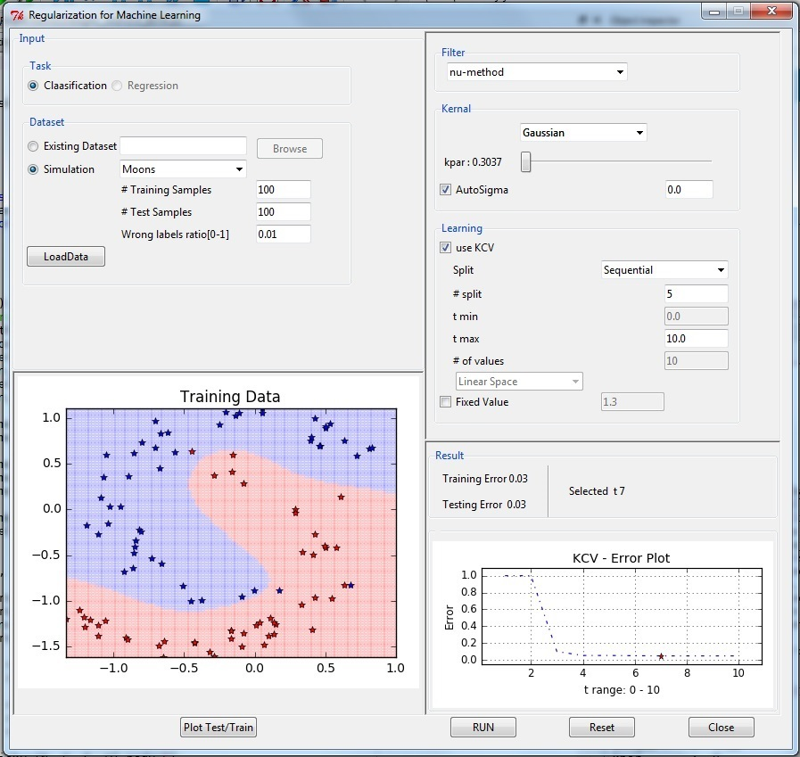

 

<h3 style="font-weight:600; font-family: sans-serif;"> Softwares/Libraries - Open Source 

</h3>   ...
  

<ul>
<li>

 

<strong>SpKit : spkit : </strong> 
<code>pip install spkit</code>
 
 
 
Signal Processing toolkit library includes, information theory based evaluation of signal, transforms techniques, filtering, some of the statistical operations, and many other analytical tools, not widely available in other pakackes
 
<a href="https://spkit.readthedocs.io/en/latest/">Documentation</a> | <a href="https://pypi.org/project/spkit/">PYPI</a> |  <a href="https://SpKiT.github.io">Homepage</a>
</li> 

<li>

 

<strong>PhyAAt :  phyaat : </strong><code style="font-size: 18px;">pip install phyaat</code> 
 
 
Python library for downloading the dataset, feature extraction, preprocessing and predictive modeling for PhyAAt project.
 
<a href="https://pypi.org/project/phyaat/"> API </a> | <a href="https://PhyAAt.github.io"> Homepage</a>
</li>

<li>

 

<strong>PyLFSR :  pylfsr :</strong> <code>pip install pylfsr</code> 
  
Python library to generate pseudo random bit stream using Linear Feedback Shift Register. It also includes the tests of LFSR for three properties and A5/1 and Geffe Generators. 
 <a href="https://lfsr.readthedocs.io/en/latest/">Documentation</a> | <a href="https://pypi.org/project/pylfsr/">PYPI</a> | <a href="https://pylfsr.github.io"> Homepage</a>
</li>

 

<li><strong>RegML :  regml : </strong><code>pip install regml</code> 
 
 
Python implementation for <strong>Reg</strong>ularization methods for <strong>M</strong>achine <strong>L</strong>earning with GUI, includes kernel learning and and regularizations techniques.
 
<a href="https://pypi.org/project/regml/">PYPI</a> | <a href="https://github.com/Nikeshbajaj/Regularization_for_Machine_Learning"> Homepage</a>
</li>

<li>

 

<strong>MLEnd: mlend: </strong><code>pip install mlend</code> 
 
 
Python library for downloading and beachmarking for MLEnd Datasets
 
<a href="https://pypi.org/project/mlend/">PYPI</a> | <a href="https://mlend.readthedocs.io/en/latest/"> API </a> | <a href="https://MLEndDatasets.github.io"> MLEnd Datasets - Homepage</a>
</li>
</ul>

	

