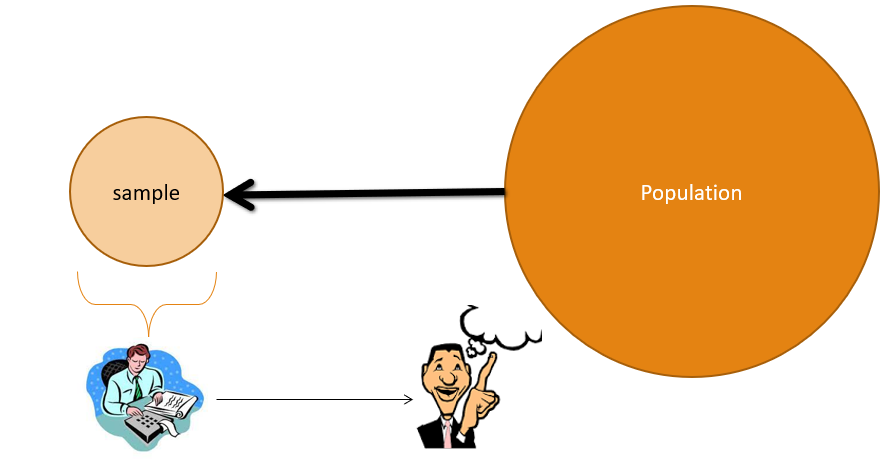

### Teaching/Stats

# Statistics for Medical Students
**Date: Sep 2022**

    

        <h3>Description</h3>
            
        

    

        

        These sessions are planned for the students with limited computational background to use statistics to describe and represent data and to define hypothesis and test it properly with details explanations and results. This session is for a group of 15-20 students of MSc Cardiovascular and Respiratory Healthcare program (1st Year), with diverse background (e.g. nursing, administrations, radiologist, etc). 
          
        There are two sessions; first session, which is more of theoratical,  is divided into three parts – (1) Describe your data, (2) Inferential Statistics, and (3) Hypothesis design and testing. Second session is planned with computer lab, to use SPSS with given dataset.
        
 

        <b>Session 1:</b>
        <ul>
        <li> Describe your data </li>
        <ul>
        <li>Descriptive statistics - summarising the data </li>
        <li>Visualisation (plots and figures)</li>
        </ul>
        <li>Inferential analysis:</li>
        <ul>
        <li>Inference about population from sample </li>
        </ul>
        <li>Given two groups of data </li>
        <ul>
        <li>Test the differences between groups (hypothesis testing) </li>
        <li>Test the relationship between two variables (correlation) </li>
        </ul>
        </ul>
        <b> Session 2 </b>
        <ul><li> SPSS Lab session </li></ul>
        

        <!-- <ul>
            <li><a href="" target="_blank">Syllabus</a></li>
            <li><a href="">DOWNLOAD All Course Materials</a></li>
        </ul> -->
        

    

    

        <h3>Session Material</h3>
        
        

    

        

            <!-- 
Overview
 -->
        

        <ul class='list-inline'>
        <li><a href="files/Introduction_to_Statistics.pdf" target="_blank"><aa class="btn btn-small btn-highlight">Slides - PDF</aa></a></li>
        <li><a href="https://nikeshbajaj.github.io/teaching/stats_demo" target="_blank"><aa class="btn btn-small btn-highlight">Web-demo</aa></a></li>
        <li><a href="https://nikeshbajaj.github.io/teaching/spss_session/WorkSheet_SPSS_Session" target="_blank"><aa class="btn btn-small btn-highlight">SPSS Worksheet</aa></a></li>
        </ul>
        

    

